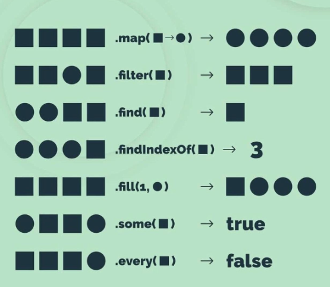

# **Essential JavaScript for ReactJS**

[← Kembali](./)

<!-- [Versi Google Docs]() -->

## **Apa itu JavaScript**
JavaScript adalah bahasa pemrograman yang sangat populer dan banyak digunakan dalam pengembangan web. Awalnya dibuat untuk menambahkan interaktivitas pada halaman web, JavaScript sekarang digunakan untuk berbagai tujuan, baik di sisi klien (client-side) maupun sisi server (server-side).

Di sisi klien, JavaScript digunakan untuk membuat halaman web menjadi lebih interaktif dan responsif. Misalnya, JavaScript dapat digunakan untuk memvalidasi input formulir, membuat animasi, mengubah konten halaman secara dinamis, dan banyak lagi.

JavaScript adalah sebuah bahasa pemrograman _interpreted_ artinya, ia tidak perlu di-_compile_ dahulu menjadi bahasa mesin. Contoh lain dari bahasa _interpreted_ adalah Python. Sementara contoh bahasa _compiled_ adalah **C, C++, Go, dan Java.

## **Intro to JavaScript**
### **1. Logging / Printing**
Untuk bisa melakukan logging dalam JavaScript, kita menggunakan object `console` dan memanggil method `log()`. Contoh:

```
console.log("Hello World!")
```

### **2. Variabel**
Variabel adalah suatu suatu tempat untuk menyimpan suatu nilai. Berikut cara mendefinisikan sebuah variabel:
```
const nama = "Zaki";    // Nilai tidak bisa diubah
let umur = 21;          // Nilai bisa diubah
```

### **3. Tipe Data**
 - **Number**   : `123`
 - **String**   : `"Halo"`
 - **Boolean**  : `true`, `false`
 - **Array**    : `["Ahmad", "Zaki", "Akmal"]`
 - **Object**   : `{nama: "Zaki", niu: "480179", prodi: "TIF"}`

 ⚠️ JS adalah bahasa yang bersifat _dynamic typing_, sehingga variabelnya bisa berganti tipe data. Usahakan untuk mempertahankan tipe data suatu variabel untuk tetap sama.

### **4. Operasi Dasar**
| Operator | Arti |
| -------- | ---- |
| + | Penambahan / Addition |
| - | Pengurangan / Substraction |
| * | Perkalian / Multiplication |
| ** | Perpangkatan / Exponent |
| / | Pembagian / Division |
| % | Modulus |
| ++ | Increment |
| -- | Decrement |

⚠️ Perhatikan ketika melakukan operasi untuk variabel yang berbeda tipe data.

### **5. Perbandingan**

| Operator | Description | Example | Result     |
|-|-|-|-|
| `==` | Sama dengan | `5 == "5"` | `true` |
| `===` | Sama dengan (_strict_) | `5 === "5"` | `false`    |
| `!=` | Tidak sama dengan | `5 != "5"` | `false` |
| `!==` | Strictly not equal to (value and type)| `5 !== "5"` | `true` |
| `>` | Lebih dari | `5 > 3` | `true` |
| `<` | Kurang dari | `5 < 3` | `false` |
| `>=` | Greater than or equal to | `5 >= 5` | `true` |
| `<=` | Less than or equal to | `5 <= 5` | `true` |


## **Other Important Concepts**
### **String**
String adalah sederetan karakter yang membentuk sebuah kata atau kalimat.
```
  const nama = "Zaki";
  const menyapa1 = "Halo " + nama + "!";
  const menyapa2 = `Halo, ${nama}!`
```

### **Conditioning**
Conditioning adalah cara untuk menentukan apa yang harus dilakukan ketika suatu kejadian terpenuhi atau tidak terpenuhi.
```
  const nilai = 60;

  if(nilai >= 50) {
    console.log("Nilai kamu C");
  } else  if (nilai >= 70) {
    console.log("Nilai kamu B");
  } else if (nilai >= 90) {
    console.log("Nilai kamu A");
  } else {
    console.log("Nilai kamu D");
  }
```

```
  const nilai = 60;

  console.log(
    nilai > 75 ? "Kamu lulus" : "Kamu tidak lulus"
  )
```

### **Function**
Function adalah suatu proses yang bisa menerima input dan mengembalikan suatu output. Biasanya dalam matematika fungsi adalah seperti ini `f(x) = x+5`. Fungsi itu dapat dibuat dalam program yaitu sebagai berikut.
```
  function f(x) {
    return x + 5;
  }
  console.log(f(5));    //  output: 10

  const f = (x) => {
    return x + 5;
  } 
  console.log(f(10));   //  output: 15
```

### **Array**
Array adalah tipe data yang bisa menyimpan banyak nilai dalam suatu deretan. Array dalam JS bisa menyimpan tipe data yang berbeda, tetapi tetap lebih disarankan untuk menyimpan tipe data yang sama.
```
  const numbers = [1, 2, 3, 4];
  const fruits = ["apple", "grape", "banana"];
```
Tiap item dalam array bisa diakses sesuai indexnya.
```
  const numbers = [1, 2, 3, 4];
  const fruits = ["apple", "grape", "banana"];

  console.log(numbers[1]);
  console.log(fruits[2]);
```
Array juga memiliki banyak method yang bisa kita gunakan. Di sini hanya dicontohkan yang sering digunakan untuk ReactJS nantinya.



**`push()`** - Menambahkan entri baru ke dalam array.
```
  const fruits = ["🍎", "🍇", "🍌"];
  fruits.push("🍊");

  console.log(fruits);
```

**`pop()`** - Menghapus entri terakhir di array.
```
  const fruits = ["🍎", "🍇", "🍌"];
  fruits.pop();

  console.log(fruits);
```

**`forEach()`** - Meng-_apply_ suatu fungsi ke setiap nilai dalam array.
```
  const fruits = ["apple", "grape", "banana"];

  fruits.forEach((fruit) => {
    console.log(fruit)
  })

  const numbers = [1, 2, 3, 4];

  numbers.forEach((number) => {
    console.log(number + 1)
  })
```

**`map()`** - Meng-_apply_ suatu fungsi ke setiap nilai dalam array dan **mengembalikan array baru**.
```
  const numbers = [1, 2, 3, 4, 5, 6, 7, 8, 9, 10];
  
  const numbersSquared = numbers.map((number) => {
    return numbers ** 2;
  })

  console.log(numbersSquared);
```

**`filter()`** - **Membuat array baru** yang sesuai dengan kondisi yang diberikan.
```
  const numbers = [1, 2, 3, 4, 5, 6, 7, 8, 9, 10];

  const oddNumbers = numbers.filter((number) => {
    return number % 2 == 1
  })
```